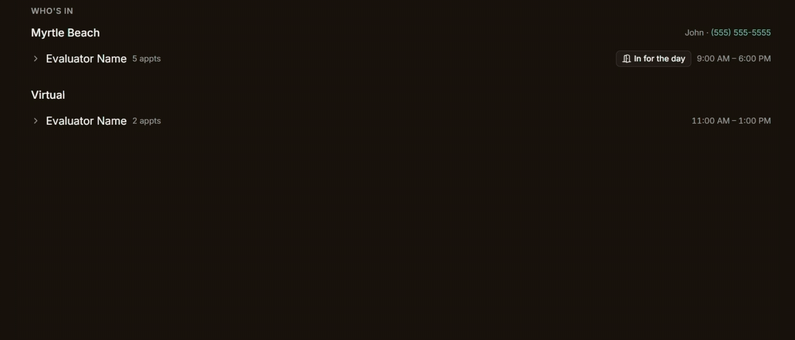
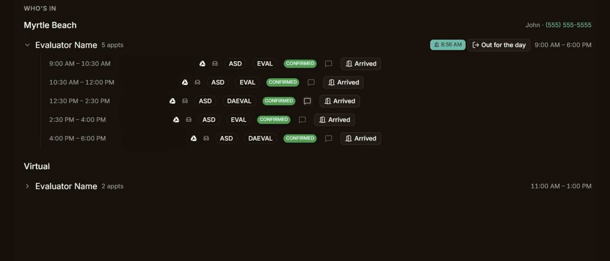
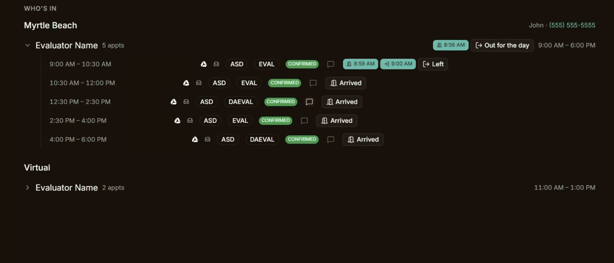

**<big>Greeters can use the Day Ahead page to track arrival and departure times of both clients and evaluators, conviently in the same place. This allows for appointment durations to be logged, in case appointments take longer than expected, allowing for future appointment scheduling to be planned accordingly.</big>**

>[!INFO] Note for Evaluators
> *We are not using this info to get you in trouble if you go over time! This is just for scheduling purposes!*

## Arrivals & Departures Process

Note: Arrivals and Departures only need to be done for in person appointments. Evaluators and clients cannot be checked in or out for virtual appointments.

### 1. Marking Evaluator(s) as "In for the Day"

**Evaluators should be marked as "In for the Day" first thing when they arrive.** This is done by clicking on the "In for the Day" button directly accross from the specific evaluators name, and clicking the "Save" button.

> [!tip] The time field will automatically fill in with the current time, however, if needed, a different time can be typed into the space and submitted instead.

Clicking on the evaluators name will open the list of clients and appointments for that evaluator for the day. This is where you can see relevant client information for the day's appointment, as well as the "Arrived" buttons for each appointment.

### 2. Marking Clients as "Arrived" + Appointments as "Started"

### 3. Marking Clients as "Left"

### 4. Marking the Evaluator(s) as "Out for the Day"
