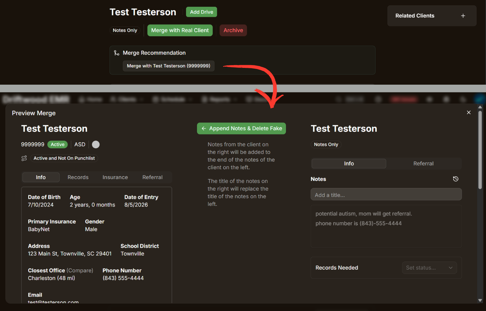
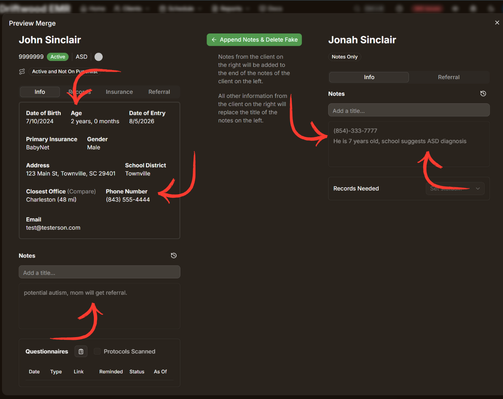
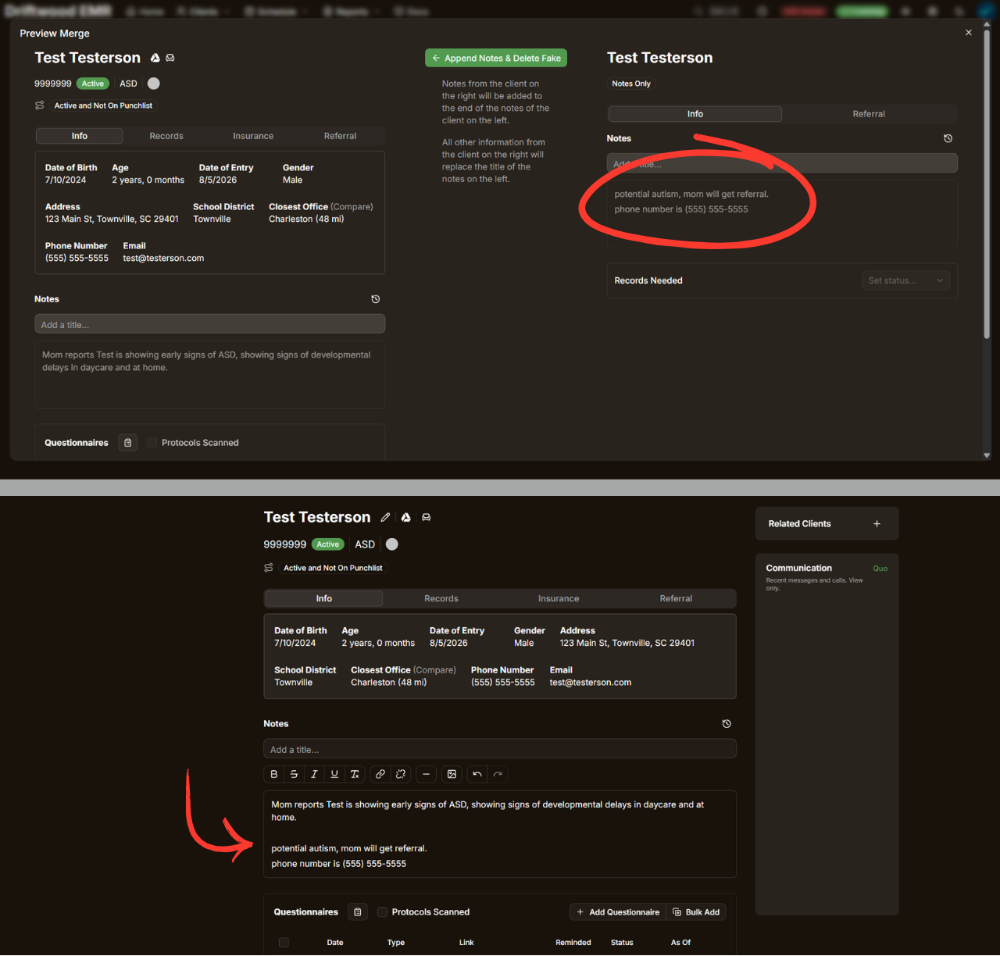

## Merge Recommendations

If a “Notes Only” client and a “Real” client page have a similar name, both pages will have an additional “Merge Recommendation” field, including a button which allows you to then merge the suggested client with the current client page.

If you believe the two clients are the same person, then you can proceed by clicking the “Merge with [client name]” button. A preview screen will pop up, displaying both clients pages, allowing you to compare and confirm that the merge has been recommended correctly.

**Note that you <u>must</u> make sure the two client pages are actually the same client before merging!**

Here is an example of 2 client pages that are being recommended to be merged. We have Jonah Sinclair, a "Notes Only" client, and John Sinclair, a similarly named client, with a "Real" client profile.

In this example, clients “Jonah Sinclair” and “John Sinclair” have similar names, so similar that the system assumes they might be the same person. This assumption is there on purpose to prevent a possible typo from causing issues. 

However, we can see by further looking at John and Jonah’s pages that they are not the same client. Jonah is noted as being 7 years old, while John is 2, and the two clients have different phone numbers and personal situations.

**These patients should not be merged, and the merge request should be ignored.**

If the merge suggestion is correct, and the client information matches, then you can safely proceed with merging the two client pages. Clicking the “Append Notes & Delete Fake” button will automatically transfer all notes on the “Notes Only“ profile over to the “Real” client page, and archive the now unnecessary “Notes Only” client page. 

Note that notes from the “Notes Only” client will be added on to the bottom of the “Real” client’s notes, however, all other information from the “Notes Only” client will override and replace the respective information for the “Real” client. This includes title, referral information, records needed status, etc.