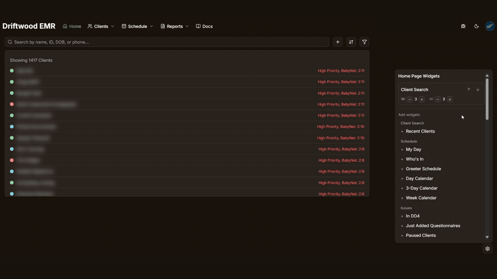
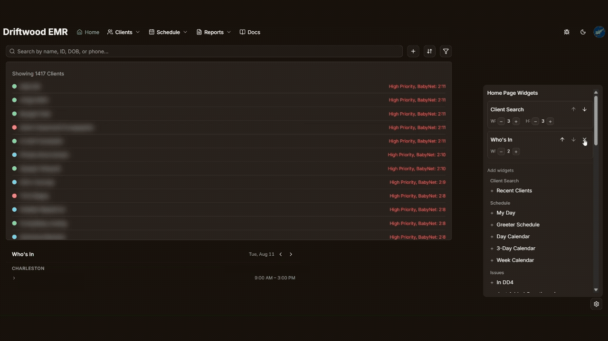
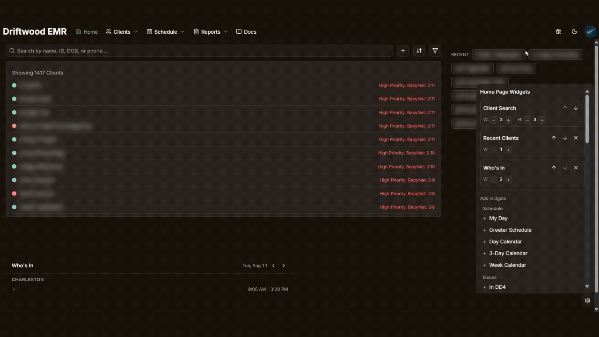
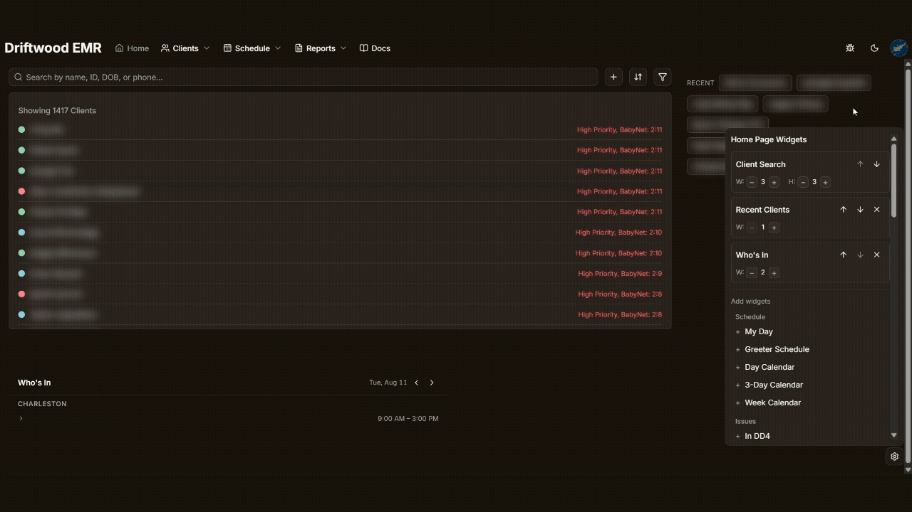

**<big>Your Home Page is always the first page you'll see when you sign in. It is also your customizable hub for easy access to the rest of the EMR. This page will explain the basic functions of your homepage and will help you figure out how to make the EMR work best for you!</big>**

## The Search bar

Search function allows for you to search for a client via:
- Name (partial or full, minimum of 3 letters)
   - Example: Typing "Jo" will not give results, but *Jon* will bring up *Jonah* or *Jonathan* or even a client with the last name *Jones*
- Birthdate (mm-dd-yyyy or mm/dd/yyyy or mm-dd-yy or mm/dd/yy, with or without extra zeros, but partial birthdates or dates without slashes or dashes will *not* register as a date)
   - Example: A client born on *March 5rd, 2024* can be searched by typing *3/5/2024*, *3/5/24*, *03/05/2024*, etc, but typing *3/5* or *030524* will not bring up the client.
- Client ID (full or partial, partial IDs can be any number of the beginning numbers but middle or end segments will not register)
   - Example: A client with the ID *1234567* can be found by searching the full ID, or searching *123* or *12345* will also work, but searching *4567* or *345* will not find the correct client.
- Phone number (partial or full, with or without parenthesis and/or dashes, any combo of numbers searched will bring up matching phone numbers)
   - Example: A client with the phone number *(542) 939-2564* can be searched via the entire number, or searching *542*, *9256*, *564*, *29392*, etc will all bring up the client.

---

## Creating a "Notes Only" client

The + icon on the home screen, next to the search bar, allows for a “Notes Only” client to be added into the system. This is for when we have some information for a client that needs to be logged before we have an official referral/TA account. Adding a “Notes Only” client makes a limited client profile with only name, notes, records needed status, and “referral information” for an initial outreach call.

Clicking on the + icon brings up a field in which you can add the clients first and last name. Type the clients first and last name in the respective boxes as shown, and click “Save”. Doing so will bring you to the new page for the client you have just created.

Here is the blank base of the new “Notes Only” client page. From here, you can add any necessary notes in the notes boxes under both client info and referral info.

Notably, from this page, you can also click the “Merge with Real Client” button to merge the “Notes Only” client page with an existing client page that is actually tied to a patient portal.

[Click Here to learn more about merging "Real" and "Notes Only" clients](merge)

---

## Sorting Clients

The "Sort by" menu allows for you to change the way in which the client list is sorted.

Clients can be sorted by:
- Priority: Sorts client list by priority status, with higher priority at the top
   1. Clients with BabyNet over the age of 2 years 6 months, sorted oldest first **AND** manually marked as High Priority
   2. Clients with BabyNet over the age of 2 years 6 months, sorted oldest first
   3. Clients manually marked as High Priority
   4. Remaining Clients sorted by "Added Date" with older clients at the top
- Last Name (alphabetical A-Z)
- First Name (alphabetical A-Z)
- PA Expiration: Sorts client list by the date that the client's prior-authorization expires, if required by insurance.

---

## Filters

The Filter menu allows for you to narrow down the client list based on the available filters.

Filters include:
- **Status** - ie. active vs inactive
- **Client Type**
   - **Real** - indicates a client profile with a tie to an actual patient portal / TA account
   - **Notes Only** - indicates a client profile created manually to take down information before a offical referral is obtained
   - **Both** - *checked by default* - simply shows all clients regardless of client type
- **Color** - allows for filtering by specific colors assigned to clients via Admin Staff
- Other Filters
   - **Hide BabyNet** - hides clients with BabyNet insurance
   - **Private Pay** - shows only clients that are private pay
   - **"Autism" in Records** - filters by clients that have records that suggest further eval. may be unwarranted
- **Insurance** - filter list that allows for clients to be narrowed down specifically by their insurance

---

## Home Page Widgets

**First off, What even is a Widget?**

A Widget is generally a modular piece of a user interface that either shows you helpful information at a glace (ie. a clock) or lets you do something interactive in a quicker fashion (ie. a search bar)

For our purposes, we have many different widgets that allow you to fully customize your own home page in a way that works best for you! You can figure out what works best for you, and add, update, move, or remove widgets via the settings button in the bottom right corner of the home page.

By default, the only widgets on your homepage will be the "Client Search" widget, which simply displays the search bar and the client list below it. The Home Page Widgets Menu allows you to add, remove, resize, and rearrange any widgets you may want, allowing for a customizable homepage suited for your specific needs.

*Note: This page is just going to explain the basics of how to add, remove, resize, and rearrange widgets. For detailed explainations of individual widgets, or answers on how to use them, [click here](widgets).*

### Adding Widgets
Adding Widgets is fairly self explainatory, simply click on the widget you want to add to your homepage from the list of widgets, and it will add itself to your homepage. Adding a widget to your homepage will also add it to the list of widgets at the top of the Home Page Widgets menu, and remove it from the list of widgets that you can add.

### Removing Widgets
Removing a widget is also pretty straight forward. To remove a widget from your homepage, simply click the "x" for the widget you wish to remove in the Home Page Widgets menu. This will remove the widget from the list (and your homepage), and readd it to the "add widget" list below.

### Resizing Widgets
Resizing widgets can be done at any point after you add a widget to your homepage from the list of widgets at the top of the Home Page Widget menu.

Under the name of each widget in the list, there will be one or two numbers with "+" and "-" next to them, with either the labels "W" for Width or "H" for height. You can change the width or height of a widget, if applicable, by using the "+" and "-" buttons to make a widget bigger or smaller.

Changing the size of widgets may result in the automatic rearranging of other widgets, especially if the widget below the resized widget now fits next to it, or if the resized widget ends up being too large for other widgets next to it.

### Rearranging Widgets
Like with resizing, rearranging widgets that are on your home page can be done with buttons in the list of widgets at the top of the Home Page Widgets menu. To the left of the "x", each widget has both up and down arrows. These allow you to move widgets around.

Widgets will automatically arrange themselves from top to bottom according to the order they are shown in the list, and the way they fit together based on size. The up arrow will move a widget up the list, the down arrow will move it down the list.

This is the ultimate way to customize your homepage to best serve your needs. Move what you need the most often up to the top, or have that one widget you use only sometimes down at the bottom.

---
