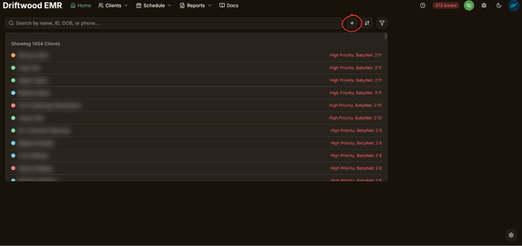

The + icon on the home screen, next to the search bar, allows for a “Notes Only” client to be added into the system. This is for when we have some information for a client that needs to be logged before we have an official referral/TA account. Adding a “Notes Only” client makes a limited client profile with only name, notes, records needed status, and “referral information” for an initial outreach call.

